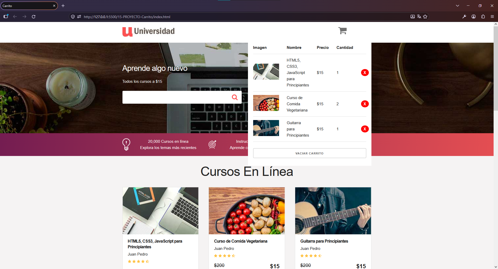

# 🛒 Carrito de Compras

Aplicación web interactiva desarrollada como parte del curso **JavaScript Moderno: Guía Definitiva Construye +10 Proyectos**.

El proyecto consiste en un carrito de compras desarrollado con JavaScript, implementando manipulación del DOM, manejo de eventos y persistencia de información mediante LocalStorage.

## 🚀 Demo

[Disponible mediante GitHub Pages.](https://cristhianychr.github.io/carrito-compras-js/)

## 📸 Vista previa



## 🛠️ Tecnologías utilizadas

* HTML5
* Tailwind CSS
* JavaScript
* DOM
* LocalStorage
* Git
* GitHub Pages

## ✨ Funcionalidades

* Visualización de productos.
* Agregar productos al carrito.
* Eliminar productos del carrito.
* Actualizar cantidades.
* Cálculo dinámico del contenido del carrito.
* Persistencia del carrito mediante LocalStorage.
* Interacción con elementos de la interfaz mediante JavaScript.
* Recuperación del carrito almacenado al recargar la página.
* Actualización dinámica de la interfaz.

## 🎯 Conceptos de JavaScript aplicados

* Manipulación del DOM.
* Event Listeners.
* Funciones.
* Arrays.
* Objetos.
* Métodos de arrays.
* Manipulación dinámica del HTML.
* Manejo de eventos.
* LocalStorage.
* Persistencia de información en el navegador.
* Serialización y deserialización de datos con JSON.

## 📂 Estructura del proyecto

```text
carrito-compras-js/
│
├── css/
├── img/
│   └── preview.png
│
├── js/
├── index.html
├── .gitignore
└── README.md
```

## 🚀 Instalación

Clona el repositorio:

```bash
git clone https://github.com/cristhianychr/carrito-compras-js.git
```

Ingresa al proyecto:

```bash
cd carrito-compras-js
```

Abre `index.html` en tu navegador.

## 🎓 Curso

Proyecto desarrollado durante el curso:

**JavaScript Moderno: Guía Definitiva Construye +10 Proyectos**

## 👨‍💻 Autor

**Cristhian Chanamé**

Estudiante de Ingeniería de Software.
